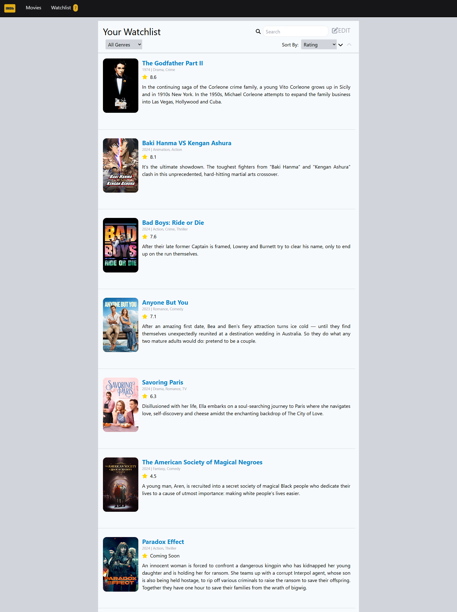

# IMDB Clone

### To run this application click [here](https://imdb-clone-project-react.netlify.app/).


## Project Summary
I've built an frontend website IMDB clone using React-Redux as a personal project to make movie discovery and management easier and more enjoyable. Here's what it offers:
1. **Homepage**: Check out top-rated movies, upcoming releases, and top actors all in one place.
2. **Trending Movies Page**: Stay updated with a page dedicated to the latest trending movies.
3. **Watchlist**: Add your favorite movies to a watchlist so you can easily keep track of what you want to watch next.
This project brings together all the best parts of movie browsing into a simple, user-friendly app. Enjoy discovering and organizing your movies!


## Installation and Downloads
### Git Commands
1. Clone git repository 
```bash
git clone <url>
```
2. Initailze git
```bash
git init
```
3. Check git status
```bash
git status
```
4. Add file to the repository
```bash
git add .
```
5. Add commit 
```bash
git commit -m 'write your commit statement'
```
6. Push code to git repository
```bash
git push
```


## Getting Started with Create React App
1. This project was bootstrapped with [Create React App](https://github.com/facebook/create-react-app).
```bash
npx create-create-app <project_name>
```

2. In the project directory, you can run.
```bash
npm start
```

3. Installed react-router-dom package to enable seamless navigation between different pages of the application without reloading the entire page.
```bash
npm install react-router-dom
```

4. Installed axios to make HTTP requests to fetch data from external APIs, handle responses, and manage errors easily and efficiently
```bash
npm i axios
```


## Tailwind
### Installtion of tailwind package
1. Install tailwind css
```bash
npm install -D tailwindcss
npx tailwindcss init
```

2. Add the paths to all of your template files in your tailwind.config.js file.
/** @type {import('tailwindcss').Config} */
module.exports = {
  content: ["./src/**/*.{html,js}"],
  theme: {
    extend: {},
  },
  plugins: [],
}

3. Add the @tailwind directives for each of Tailwind’s layers to your main CSS (index.css) file.
@tailwind base;
@tailwind components;
@tailwind utilities;


## Getting Started with Redux 
### Installation of Redux Toolkit and react-redux
1. Redux Toolkit is available as a package on NPM for use with a module bundler or in a Node application.
```bash
npm install @reduxjs/toolkit
```

2. For React bindings:
```bash
npm install react-redux
```


## Font Awesome
### Installation of font awesone package
```bash
npm i --save @fortawesome/fontawesome-svg-core
npm install --save @fortawesome/free-solid-svg-icons
npm install --save @fortawesome/react-fontawesome
```

Use [Font Awesome](https://fontawesome.com/) for adding some icons for the application.
In this application [angle-left](https://fontawesome.com/icons/angle-left?f=classic&s=solid), [angle-right](https://fontawesome.com/icons/angle-right?f=classic&s=solid), [plus](https://fontawesome.com/icons/plus?style=solid), [star](https://fontawesome.com/icons/star?f=classic&s=solid), [check](https://fontawesome.com/icons/check?f=classic&s=solid), [film](https://fontawesome.com/icons/film?f=classic&s=solid), [chevron-up](https://fontawesome.com/icons/chevron-up?f=classic&s=solid), [chevron-down](https://fontawesome.com/icons/chevron-up?f=classic&s=solid), [pen-to-square](https://fontawesome.com/icons/pen-to-square?f=classic&s=solid), [xmark](https://fontawesome.com/icons/xmark?f=classic&s=solid) and [magnifying-glass](https://fontawesome.com/icons/magnifying-glass?f=classic&s=solid)  icon is used.


## TMDB API
Used APIs for this project from [TMDB API](https://developer.themoviedb.org/reference/intro/getting-started) website.


## Workflow
#### 1. Overview
This IMDB clone project is built using React and Redux, featuring various components to create a smooth and responsive user experience. Redux handles state management through stores and slices, ensuring efficient data fetching and updates. Here are the key components used:
- **Carousel**
- **HomePage**
- **Movies**
- **MoviesPage**
- **NavBar**
- **Pagination**
- **Top Actors**
- **Top Rated Movies**
- **Upcoming Movies**
- **Watchlist**

#### 2. Home Page
- **Components**: The Home Page integrates three main components: Carousel, Upcoming Movies, and Top Rated Movies.
- **Carousel**: The carousel component automatically changes movie details every 5 seconds, providing a dynamic display of featured films.
- **Movie Sections**: The Home Page also showcases upcoming and top-rated movies. Users can add movies to the watchlist by clicking the "Add to Watchlist" button. Horizontal scrolling is enabled via left and right buttons.
- **Top Actors**: This section displays top actors, allowing horizontal scrolling to browse through different actors.
- **State Management**: Redux stores and slices manage the fetching of movie and actor details from the TMDB API using Axios. The watchlist store is used to handle movies added to the watchlist.

#### 3. Movies Page
- **Trending Movies**: This page lists all trending movies, with data fetched from the TMDB API using Axios, managed through movies store and slices.
- **Initial Display**: Initially, the page displays details of the first 20 movies.
- **Pagination**: The Pagination component is added at the bottom, with movie details passed as props. Pagination logic includes:
   - **Previous Button**: Moves to the previous set of 20 movies.
   - **Next Button**: Moves to the next set of 20 movies.
   - **Page Numbers**: Clicking on a specific page number displays movies for that page.
- **Add to Watchlist**: Users can add movies to their watchlist from this page. The watchlist store manages the addition of movies to the watchlist.

#### 4. Watchlist Page
- **Movie Details**: Displays movies added from the Home and Movies Pages, including title, description, rating, genres, and release year.
- **Local Storage**: Movie details are stored in the browser's local storage, ensuring persistence.
- **Functionality**:
   - **Genre Filter**: Users can filter movies by genre using a dropdown menu.
   - **Sorting**: Movies can be sorted by popularity, ratings, and release year in both ascending and descending order.
   - **Search**: A search bar allows users to find movies by title or description.
   - **Edit and Remove**: Users can remove movies from the watchlist by clicking the "Edit" button, selecting movies via checkboxes, and then clicking the delete button. If users change their mind, they can cancel by clicking the top-right 'X' button.

#### 5. Additional Features
- **Watchlist Count**: The count of movies in the watchlist is displayed on the NavBar and updates dynamically when movies are added or removed, managed by the watchlist store.
- **Hover Effect**: Movie cards slightly zoom when hovered over, enhancing the user experience.
- **Cancel Edit Mode**: On the Watchlist page, users can cancel the edit mode by clicking the top-right 'X' button if they decide not to remove any movies.


## Project Development Process
-	I utilize GitHub for managing version control of my codebase.
-	The basic tech stack we could use for this module are:
    - __Frontend:__ React, Redux, Tailwind, Font Awesome.
    - __Data Storage:__ Local storage (considering it's a frontend-only website).
-	During deployment, the application is built using the following command:
```bash
npm run build
```
-	The resulting build project folder is subsequently uploaded to [Netlify](https://app.netlify.com/teams/oshin-3/overview) for deployment of the application.


## Design 
__Home Page__

__Movies Page__


__Watchlist Page__

__Genre Filter__

__Soreted according to Popularity__

__Remove Movies from Watchlist__ 

